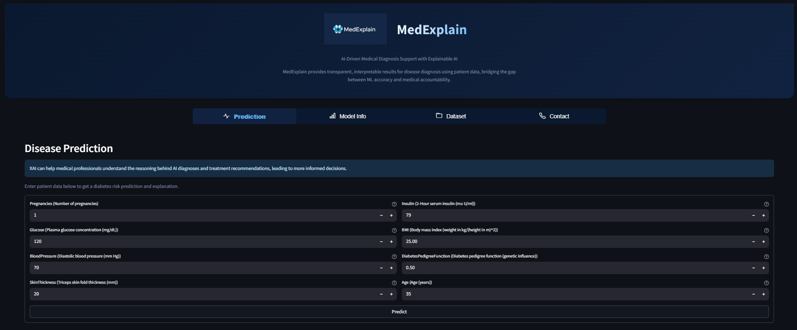
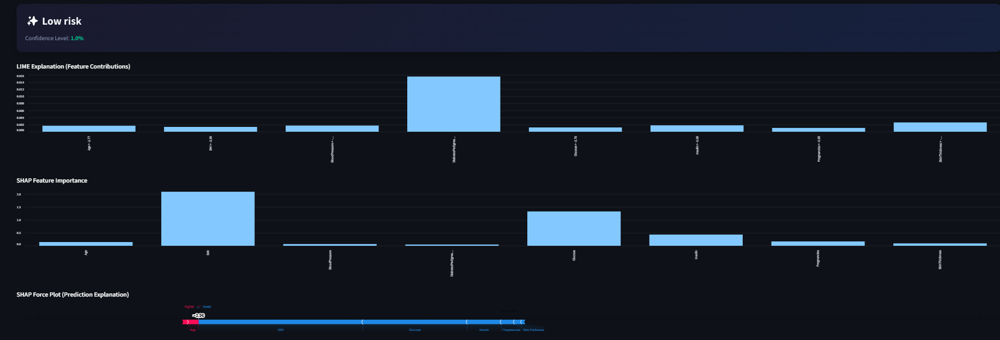
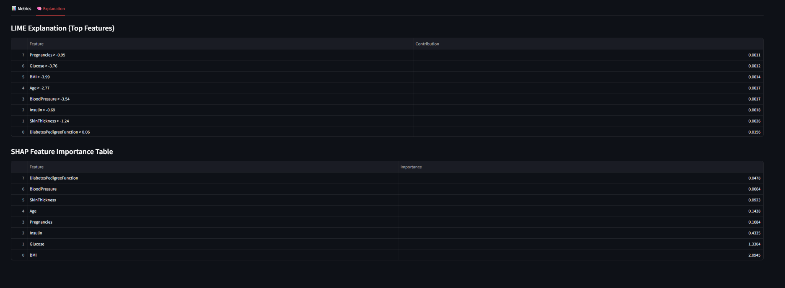
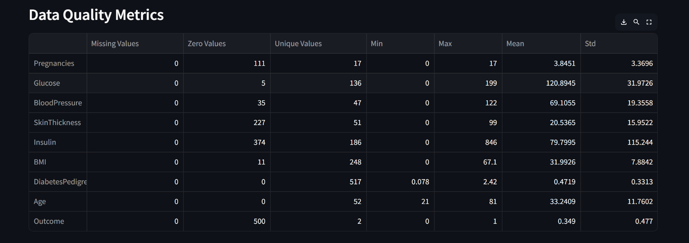

# 💡 MedExplain 🧠💉

MedExplain is an AI-driven medical diagnosis support system focused on transparent diabetes risk assessment using explainable AI (XAI). The system integrates a powerful predictive model with interpretable outputs, enabling medical professionals and patients to understand the _why_ behind the prediction.

---

## 🚀 Features

### ✅ Core Capabilities
- **Diabetes Risk Prediction**  
  Uses a trained **XGBoost** classifier on the **PIMA Indians Diabetes Dataset** for accurate risk assessment.
- **Explainability with XAI**
  - **LIME** and **SHAP** explanations showing how each feature contributed to a prediction
  - **Interactive SHAP force plots** for per-patient explanations
  - Ranked feature importance for interpretability
  - Per-input contribution breakdown
  - **XAI helps medical professionals understand the reasoning behind AI diagnoses and treatment recommendations, leading to more informed decisions.**
- **Modern, Interactive Web Interface**
  - Beautiful navigation with `streamlit-option-menu`
  - Real-time predictions with easy-to-use sliders
  - Live visualizations of results and contributing factors
  - Intuitive and user-friendly design

---

## 🖼️ Screenshots

### Home & Prediction Page


### Prediction Result with LIME/SHAP Explanation


### Prediction Evaluation Metrics


### Data Quality Metrics


---

## 🛠️ Tech Stack

| Category         | Tools & Libraries                          |
|------------------|--------------------------------------------|
| Language         | Python 3.11+                               |
| Machine Learning | XGBoost, scikit-learn                      |
| Explainability   | LIME, SHAP, streamlit-shap                 |
| Interface        | Streamlit, streamlit-option-menu           |
| Data Handling    | pandas, numpy                              |
| Visualization    | matplotlib, seaborn                        |
| MLOps            | DVC, MLflow                                |

---

## 🗂️ Project Structure

```
MedExplain/
├── data/
│   ├── raw/                # Raw input data (diabetes.csv)
│   └── processed/          # Preprocessed .npy and .joblib files
├── models/                 # Trained ML models and artifacts
│   ├── model.joblib
│   ├── scaler.joblib
│   └── feature_names.joblib
├── reports/
│   ├── metrics.json
│   ├── classification_report.json
│   └── figures/
├── src/
│   ├── download_data.py    # Download and prepare dataset
│   ├── preprocess.py       # Data preprocessing pipeline
│   ├── train.py            # Model training pipeline
│   ├── evaluate.py         # Model evaluation and reporting
│   ├── explain.py          # XAI explanations (LIME/SHAP)
│   └── predict.py          # Prediction logic
├── app.py                  # Main Streamlit interface
├── gradio_ui.py            # (Legacy) Gradio interface (optional)
├── dvc.yaml                # DVC pipeline definition
├── params.yaml             # Model and pipeline parameters
├── requirements.txt        # Dependencies list
└── README.md
```

---

## 📚 Dataset Info

- **Source:** [PIMA Indian Diabetes Dataset](https://www.kaggle.com/datasets/uciml/pima-indians-diabetes-database)
- **Type:** Binary classification
- **Features:** 8 input variables
- **Target:** Diabetic (1) or Non-diabetic (0)

---

## ⚙️ Pipeline Overview (DVC)

The project uses DVC to manage the end-to-end ML workflow:

1. **Download Data**
   ```bash
   python src/download_data.py
   ```
   Downloads the PIMA Diabetes dataset to `data/raw/diabetes.csv`.

2. **Preprocess Data**
   ```bash
   dvc repro
   ```
   Or manually:
   ```bash
   python src/preprocess.py --input data/raw --output data/processed
   ```
   - Cleans and splits data
   - Saves: `X_train.npy`, `X_test.npy`, `y_train.npy`, `y_test.npy`, `feature_names.joblib`, `scaler.joblib`

3. **Train Model**
   ```bash
   python src/train.py --data data/processed --output models/
   ```
   - Trains XGBoost (or RandomForest) model
   - Saves: `model.joblib`, `feature_names.joblib`
   - Logs metrics to `metrics.json` and MLflow

4. **Evaluate Model**
   ```bash
   python src/evaluate.py --model models/model.joblib --data data/processed --output reports/
   ```
   - Generates `metrics.json`, `classification_report.json`, and confusion matrix plot

5. **Explain Predictions**
   - Use `src/explain.py` for LIME/SHAP explanations (see script for usage)

---

## 🧾 Input Parameters

| Parameter | Description | Valid Range |
|--|--|--|
| `Pregnancies` | Number of times pregnant | 0–17 |
| `Glucose` | Plasma glucose concentration (mg/dl) | 0–200 |
| `BloodPressure` | Diastolic blood pressure (mm Hg) | 0–122 |
| `SkinThickness` | Triceps skin fold thickness (mm) | 0–99 |
| `Insulin` | 2-Hour serum insulin (mu U/ml) | 0–846 |
| `BMI` | Body mass index (kg/m²) | 0–67.1 |
| `DiabetesPedigreeFunction` | Hereditary diabetes function score | 0.078–2.42 |
| `Age` | Patient's age (years) | 21–81 |

---

## 📈 Output

- **Prediction:** Diabetic / Non-diabetic
- **Probability Score:** Model's confidence level
- **Top Contributing Features:** Ranked by influence
- **XAI Analysis:**
  - LIME feature contributions
  - SHAP value explanations
  - LIME feature contributions (visual and tabular)
  - SHAP value explanations (bar chart and interactive force plot)
  - Feature importance visualization

---

## 🧪 Configuration

- **params.yaml**: Controls model type, hyperparameters, data split, and evaluation metrics.
- **dvc.yaml**: Defines pipeline stages (`preprocess`, `train`, `evaluate`).

---

## 🏃‍♂️ Quickstart

1. **Install dependencies**
   ```bash
   pip install -r requirements.txt
   pip install dvc
   pip install streamlit-option-menu streamlit-shap ipython
   ```

2. **Download the dataset**
   ```bash
   python src/download_data.py
   ```

3. **Run the pipeline**
   ```bash
   dvc repro
   ```

4. **Launch the app**
   ```bash
   streamlit run app.py
   ```

---

## 📝 Notes

- All pipeline steps are reproducible and tracked with DVC.
- Model training and evaluation metrics are logged to MLflow and JSON files.
- For custom runs, edit `params.yaml` and re-run `dvc repro`.
- **Modern UI:** Navigation and all components use Streamlit's latest UI features and open-source libraries.
- **XAI for Clinicians:** The app is designed to help medical professionals understand and trust AI-driven predictions.

---

## 🧑‍💻 Author

Made with ❤️ by **P Sanjeev Pradeep**

Feel free to ⭐ the repo if you find it helpful or open an issue to contribute!
